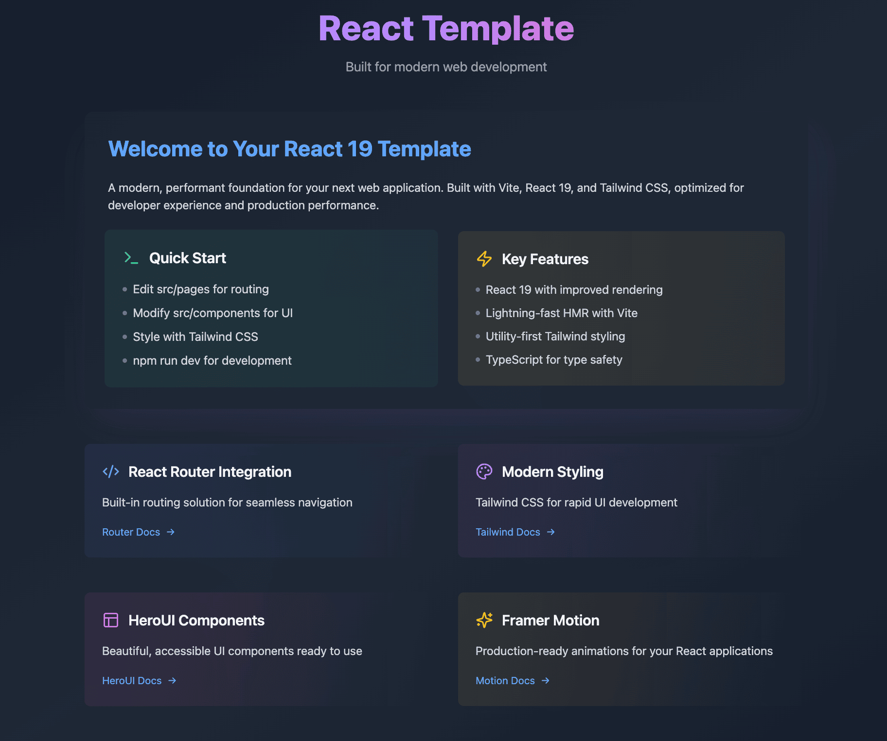

<<<<<<< HEAD
# 🚀 React 19 Template

A modern, performant foundation for your next web application. Built with **React 19, Vite, and Tailwind CSS** , this template is optimized for an excellent developer experience and production performance.



## ✨ Features

- ⚛ **React 19** – Improved rendering and latest React features
=======
# 🚀 Website Builder & E-commerce Dashboard

A modern, user-friendly foundation for building website builder and e-commerce dashboard interfaces. Built with React, TypeScript, and Tailwind CSS, this project is optimized for a seamless developer experience and consistent UI design.

## ✨ Features

- ⚛ **React 19** – Component-based architecture for reusable UI elements
>>>>>>> abc116a (Initial Commit)
- ⚡ **Vite** – Lightning-fast HMR and build times
- 🎨 **Tailwind CSS** – Utility-first styling for rapid UI development
- 🔒 **TypeScript** – Type safety and improved developer experience
- 🛠 **React Router** – Seamless navigation for your application
- 🎭 **Framer Motion** – Smooth animations for a modern UI
- 🏗 **HeroUI Components** – Beautiful, accessible UI components

---

## 🚀 Quick Start

1. **Clone the repository**
   ```bash
<<<<<<< HEAD
   git clone https://github.com/haider-patanwala/react-template.git
   cd react-template
=======
   git clone https://github.com/riteekagawand/WHC.git
   cd WHC
>>>>>>> abc116a (Initial Commit)
   ```
2. **Install dependencies**
   ```bash
   npm install
   ```
3. **Start the development server**
   ```bash
   npm run dev
   ```
4. **Build for production**
   ```bash
   npm run build
   ```

---

## 📂 Project Structure

```
<<<<<<< HEAD
📦 react-template
├── 📂 src
│   ├── 📂 components  # Reusable UI components
│   ├── 📂 pages       # Application pages for React Router
│   ├── 📂 assets      # Images, icons, and static files
│   ├── main.tsx      # Entry point for React
│   ├── App.tsx       # Main application component
│   └── routes.tsx    # React Router configuration
├── 📄 index.html      # HTML template
├── 📄 tailwind.config.js  # Tailwind CSS configuration
├── 📄 vite.config.ts  # Vite configuration
└── 📄 package.json    # Project dependencies and scripts
=======
📦 website-builder-ecommerce-dashboard
├── 📂 src
│   ├── 📂 components  # Reusable UI components
│   │   ├── Builder.tsx              # Website Builder main component
│   │   ├── EcommerceDashboard.tsx   # E-commerce Dashboard main component
│   │   ├── TemplateCard.tsx         # Card for templates in Website Builder
│   │   ├── StartFromScratchCard.tsx # Card for "Start from Scratch" options
│   │   ├── SummaryCard.tsx          # Card for summary stats in E-commerce Dashboard
│   │   ├── OrderRow.tsx             # Table row for recent orders
│   │   ├── ProductItem.tsx          # List item for top products
│   │   ├── PaymentMethodItem.tsx    # List item for payment methods
│   │   └── Header.tsx               # Header for Website Builder
│   ├── App.tsx                      # Main application component
│   ├── index.tsx                    # Entry point for React
│   ├── index.css                    # Tailwind CSS setup
│   └── ...
├── 📄 index.html                    # HTML template
├── 📄 tailwind.config.js            # Tailwind CSS configuration
└── 📄 package.json                  # Project dependencies and scripts

>>>>>>> abc116a (Initial Commit)
```

---

## 🔗 Documentation

- 📜 **[React Router](https://reactrouter.com/)** – Built-in routing for seamless navigation
- 🎨 **[Tailwind CSS](https://tailwindcss.com/docs/)** – Modern styling framework
- 📦 **[HeroUI](https://heroui.dev/)** – Prebuilt, accessible UI components
- 🎭 **[Framer Motion](https://www.framer.com/motion/)** – Smooth animations for React

---

## 📜 License

This project is open-source and available under the [MIT License](https://chatgpt.com/c/LICENSE).

---
