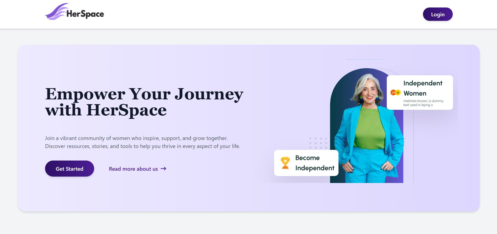

# HerSpace: Empowering Women Entrepreneurs

## Overview
HerSpace is a digital platform designed to help women entrepreneurs seamlessly create, manage, and grow their online businesses. With intuitive tools like a website builder, e-commerce solutions, and AI-powered insights, we remove technical barriers and provide a streamlined experience.

## Features
- *Effortless Website Builder* – Drag-and-drop functionality with customizable templates.
- *Analytics Dashboard* – Real-time insights on visitor behavior and engagement.
- *AI-powered Resource Hub* – Business courses, resume builder, and curated learning materials.
- *SEO & Keyword Optimization* – AI-driven recommendations to enhance online visibility.
- *AI Assistant* – Business insights, automated customer support, and content suggestions.
- *Multilingual Support* – Ensuring accessibility across diverse user bases.

## Technology Stack
- *Frontend:* React.js (for a dynamic and responsive user experience)
- *Backend:* Node.js (Express) (for efficient API handling and backend logic)
- *Database:* PostgreSQL (for structured data management and scalability)
- *Hosting:* Vercel (for seamless deployment and high availability)

## Impact & Scalability
HerSpace aims to revolutionize women-led businesses by:
- Increasing digital inclusion for women entrepreneurs.
- Enhancing business visibility and growth.
- Enabling financial independence through e-commerce.
- Building a strong support network via community engagement.

## Get Started
1. Sign up on [HerSpace](#) and create your business profile.
2. Customize your website using pre-built templates.
3. Use analytics and AI tools to optimize your business strategy.

## Contact
For support or inquiries, reach out to us at *support@herspace.com*.

